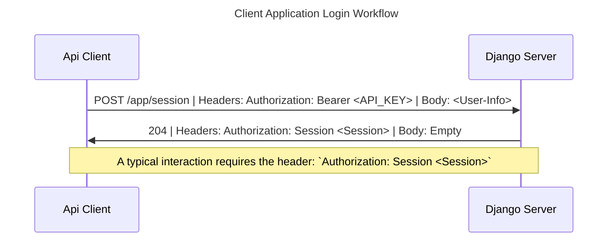
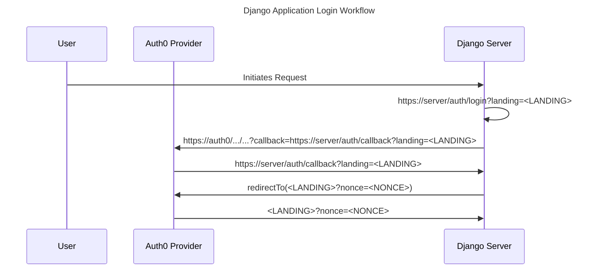

# Auth1: Auth0 Integration

```mermaid
---
title: Client Application Login Workflow
---
sequenceDiagram
    participant Client as Api Client
    participant Django as Django Server
    Client->>Django: POST /app/session | Headers: Authorization: Bearer <API_KEY> | Body: <User-Info>
    Django->>Client: 204 | Headers: Authorization: Session <Session> | Body: Empty
    Note over Django,Client: A typical interaction requires the header: `Authorization: Session <Session>`
```

```mermaid
---
title: Django Application Login Workflow
---
sequenceDiagram
    participant User as User
    participant Auth0Provider as Auth0 Provider
    participant Django as Django Server


    User->>Django: Initiates Request
    Django->>Django: https://server/auth/login?landing=<LANDING>
    Django->>Auth0Provider: https://auth0/.../...?callback=https://server/auth/callback?landing=<LANDING>
    Auth0Provider->>Django: https://server/auth/callback?landing=<LANDING>
    Django->>Auth0Provider: redirectTo(<LANDING>?nonce=<NONCE>)
    Auth0Provider->>Django: <LANDING>?nonce=<NONCE>

```
